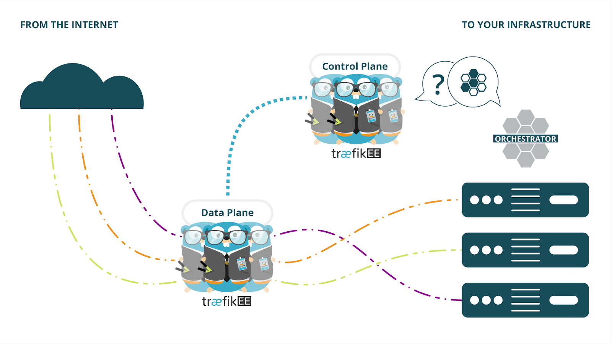

# Traefik Enterprise Edition on Docker Enterprise Edition with Docker Swarm

Traefik Enterprise Edition (Traefik EE) is a production-grade, distributed, and highly-available routing solution built on top of [Traefik](https://traefik.io/).

Containous aims at simplifying the life of today’s DevOps and Site Reliability Engineers (SREs) with an easy-to-install, robust and secure edge router. Our cloud-native solution enables users to address all the routing (simple to very complex), load balancing, tracing and observability, and governance needs they may have with a small footprint. Containous is a cloud-agnostic and legacy friendly routing solution.
Traefik EE is an enterprise-grade ingress controller built upon the acclaimed open source edge router 'Traefik'. It benefits from one of the most vibrant and supportive communities and caters to all the 'wiring' needs of your microservices projects, whether you are starting from scratch (greenfield) or transitioning away from a different infrastructure.



To learn more about Traefik EE concepts, see [Concepts of the documentation](https://docs.containo.us/learning/concepts/).

For production environments, Docker recommends using deploying Traefik EE data nodes on Docker EE workers dedidicated to load balancing.  Our goal is to achieve an environment similar to our [Layer 7 Routing with Interlock](https://docs.docker.com/ee/ucp/interlock/deploy/production/) documentation.

##### todo <insert architecture diagram of our goal: 3 control node, 2 data node, nodetype==loadbalancer, host-mode publishing.

## Prerequisites

The 'Traefik Enterprise Edition Production Best Practices Solution Brief for Docker Enterprise and Swarm' solution guide has been tested using the following environment:

- Docker EE 2.1
- TraefikEE v1.0.1, with [the command-line tool `traefikeectl`](https://docs.containo.us/installation-guides/getting-started/#install-traefikeectl)
- A [valid TraefikEE license](https://containo.us/traefikee/) stored in the environment variable `$TRAEFIKEE_LICENSE_KEY`
- An external layer 4 load-balancer and associated DNS A record

This guide assumes you are familiar with the basic architecture of Traefik outlined in the [Solution Guide](https://docs.containo.us/solutions/dockeree/)

#### A Note on Terminology

This guide often refers to Traefik EE "control" and "data" nodes.  There are various ways of deploying the components of Traefik EE and the number of containers may not necessarily be equal to the number of nodes that Traefik is deployed on.  For the purposes of this guide a Traefik control node or Traefik data node refers to a single Traefik EE container deployed in a given cluster or the collective Traefik EE containers, not the underlying Docker EE infrastructure.

We also use the term "workload" to mean any services deployed on your UCP worker nodes that are not UCP platform-related or specifically related to Traefik EE.

## Ingress Planning Requirements

### Name Resolution

To reach Traefik EE data nodes from an external network, we recommend a wildcard DNS record that resolves to an external load-balancer distributing requests to your Docker EE workers hosting Traefik EE data nodes.

If you intend to administrate Traefik EE with `traefikeectl` on your local workstation, you may also need to adjust your UCP loadbalancer to allow traffic through the `traefikeectl` API port (default: `55055`).

In this guide, we make the assumption that there is an A record `*.tr.domain.com` that resolves to a load balancer, distributing requests to Traefik EE data nodes.  We assume that there is a separate A record and load balancer for UCP, such as `ucp.domain.com`.

### Ports

Operating Traefik EE requires the use of certain cluster ports:

- 2 available ports on the Docker EE worker nodes that will be dedicated for load balancing: Let's say `9080` and `9443`
    - Configure your external load balancer to forward port `80` -> `9080` targeting your load balancer nodes, and repeat for `443` -> `9443`
- The Control API port, used by `traefikeectl` to communicate with control nodes (default: 55055)
- The dashboard port, where the dashboard is served (default: 8080) on the control nodes

The Control API port, with Traefik EE, is mTLS encrypted.  See the related documents on [Security](https://docs.containo.us/learning/concepts/#security).

### Scheduling

Traefik EE control nodes require access to Docker APIs.  Traefik EE 1.0.1, at the time this guide was written, is not able to use TLS certificates to authenticate against the UCP APIs, therefore we must bind Docker's control socket on the manager nodes.  Refer to our [Engine Security](https://docs.docker.com/engine/security/https/) documentation for more information on protecting the Docker socket.  In a future version, Traefik EE will add support for TLS authentication so that it may communicate with the Docker APIs via UCP client certificates.

## Installation

You can install Traefik EE in HA Mode using
[Advanced Installation of Traefik Enterprise Edition on Swarm with Compose Files](https://docs.containo.us/installation-guides/swarm/compose/n-cn/),

#### Minimum Requirements
- The `traefikeectl` tool installed on a manager node or on your workstation
- A Docker Swarm (swarm mode) cluster:
  - Version: >= 1.13 (minimum API version 1.25)
  - At least 3 manager nodes, and at least 2 worker nodes
- Docker client
  - Version: >= 1.13 (minimum API version 1.25)
  - Either:
    - Configured to communicate with your swarm cluster by sourcing a [UCP Client Bundle]()
    - Available locally on one of the manager nodes
- Ingress ports are available and reachable
- `traefikeectl` API port is reachable (default: `55055`)

#### Install Prerequisites
```sh
# obtain `traefikeectl`
mkdir traefikeectl && cd traefikeectl
curl -sSL \
  https://s3.amazonaws.com/traefikee/binaries/v1.0.1/traefikeectl/traefikeectl_v1.0.1_linux_amd64.tar.gz | tar xvz
mv traefikeectl /usr/bin/.

# obtain the compose files
curl -sSL \
  https://s3.amazonaws.com/traefikee/examples/v1.0.1/swarm/traefikee-swarm-v1.0.1.tar.gz | tar xvz

# create the Traefik EE License Secret
read -sp 'Traefik EE License Key: ' TRAEFIKEE_LICENSE_KEY
echo -n ${TRAEFIKEE_LICENSE_KEY} | docker secret create <^>traefikee-license<^^> -
```

> Note: If you are installing TraefikEE from behind a corporate proxy, you will need to add the following environment
variables to each deployment YAML so that TraefikEE may navigate the proxy:
```yaml
services:
  control-node: # or bootstrap-node or data-node.
    # [...]
    environment:
      HTTP_PROXY: "http://127.0.0.1:3129"
      HTTPS_PROXY: "http://127.0.0.1:3129"
```

#### Bootstrap the Traefik EE Control plane

##### Create the Traefik EE control plane network

```sh
docker network create --driver=overlay <^>traefikee-control<^^>
```

##### Create the `bootstrap-node` service

Edit bootstrap-node.yml, and set the name of the control plane network
```yaml
networks:
  traefikee-net:
    name: <^>traefikee-control<^^>
    external: true
```

Set the name of our secret containing our license key
```yaml
secrets:
  traefikee-license:
    external: true
    name: <^>traefikee-license<^^>
```

Under the `command:` key, replace the rest of the variable prompts with appropriate values for your environment and change `--timeout=120` to `--timeout=600`
```yaml
    command:
      - "bootstrap"
      - "--swarmmode"
      - "--swarmmode.network=<^>traefik-control<^^>
      - "--swarmmode.licensesecret=traefikee-license"
      - "--traefikeelog.traefik=<^>debug<^^>
      - "--clustername=<^>traefikee-swarm<^^>"
      - "--api"
      - "--timeout=600"
      - "--controlNodes=<^>3<^^>"
```

Alternatively, wherever there is a `${VARIABLE}` in a compose file, you may export those variables in your shell and "docker stack deploy" will use those values instead
```sh
export TRAEFIKEE_LICENSE_SECRET=<^>traefikee-license<^^>
export TRAEFIKEE_SWARM_NETWORK=<^>traefikee-control<^^>
export TRAEFIKEE_EXPECTED_CONTROL_NODES=<^>3<^^>
export TRAEFIKEE_LOG_LEVEL=<^>debug<^^>
export TRAEFIKEE_CLUSTER_NAME=<^>traefikee-swarm<^^>
```

Save the file.  Completed, it should look similar to the following:
```yaml
---
version: '3.6'
networks:
  traefikee-net:
    name: traefikee-control
    external: true
secrets:
  traefikee-license:
    name: traefikee-license
    external: true
services:
  bootstrap-node:
    image: containous/traefikee:v1.0.1
    deploy:
      restart_policy:
        condition: on-failure
      placement:
        constraints:
          - node.role == manager
    volumes:
      - /var/run/docker.sock:/var/run/docker.sock
    secrets:
      - traefikee-license
    networks:
      - traefikee-net
    command:
      - "bootstrap"
      - "--swarmmode"
      - "--swarmmode.network=traefikee-control"
      - "--swarmmode.licensesecret=traefikee-license"
      - "--traefikeelog.traefik=debug"
      - "--clustername=traefikee-swarm"
      - "--api"
      - "--timeout=600"
      - "--controlNodes=3"
    labels:
      - "traefikee=bootstrap-node"
```

Finally, deploy the `bootstrap-node` service and verify that it is scheduled
```sh
docker stack deploy -c bootstrap-node.yml <^^>traefikee-swarm<^>
docker service ps <^>traefikee-swarm<^^>_bootstrap-node
docker service logs -f <^>traefikee-swarm<^^>_bootstrap_node
```

#### Create the `control-node` service

Edit `control-node.yaml` and set compose API version to '`3.7`'
```yaml
version: '3.7'
```

Next, configure the name of the Traefik EE control plane network
```yaml
networks:
  traefikee-net:
    name: <^>traefikee-control<^^>
    external: true
```

Next, set the name of the Traefike EE control node join token

> The name of the secret will be "<cluster-name>-control-node-join-token".
  You can use `docker secret ls` to discover it
```sh
docker secret ls
# ID                          NAME                                        DRIVER              CREATED              UPDATED
# iwh6gkt7vdksecv9dg1d1ayy8   traefikee-swarm-control-node-join-token                       About a minute ago   About a minute ago
# ktpk6p88nf31ldo8byrtnobg5   traefikee-swarm-data-node-join-token                          About a minute ago   About a minute ago
# ld6mvz4lh1ox0u7iofqjiwdl1   traefikee-license                                               7 minutes ago        7 minutes ago
# i550mhwctoryyyeujttx0bwr9   ucp-auth-key                                                    4 days ago           4 days ago
```
In our case, <^>traefikee-swarm<^^>-control-node-join-token

```yaml
secrets:
  traefikee-control-node-join-token:
    external: true
    name: <^>traefikee-swarm<^^>-control-node-join-token
```

Continue editing `control-node.yaml` and add `update_config`, `rollback_config`, and `restart_policy` parameters

> Note:  these timers should be generous to ensure that when the control plane is updated with "docker service update", we do not shut down more than 1 control node at a time in order to maintain a quorum.
The given settings provide about ~90s of delay in between task restarts to allow for the control plane to converge.  These timers may be adjusted for your environment.


```yaml
services:
  control-node:
    image: containous/traefikee:v1.0.1
    deploy:
      mode: replicated
      replicas: ${TRAEFIKEE_CONTROL_NODE_REPLICAS_COUNT}
      restart_policy:
        condition: any
        delay: 5s
        max_attempts: 3
        window: 60s
      update_config:
        parallelism: 1
        delay: 60s
        failure_action: rollback
        max_failure_ratio: .25
        order: start-first
      rollback_config:
        parallelism: 1
        failure_action: pause
        order: start-first
      placement:
        constraints:
          - node.role == manager
        ...
```

Then, configure the Traefik EE dashboard and `traefikeectl` API ports, if desired.  These will default to `8080` and `55055`, respectively.
```yaml
    ports:
      - ${TRAEFIKEE_DASHBOARD_PORT:-8080}:8080
      - ${TRAEFIKEE_CTLAPI_PORT:-55055}:55055
```

Then, configure the `command:` key and replace the `${TRAEFIKEE_LOG_LEVEL}` and `${TRAEFIKEE_SWARM_NETWORK}` variables
```yaml
    command:
      ...
      - "--traefikeelog.traefik=<^>info<^^>"
      - "--swarmmode"
      - "--swarmmode.network=<^>traefikee-control<^^>"
      - "--swarmmode.jointokensecret=traefikee-control-node-join-token"
```

Finally, replace the `${TRAEFIKEE_PEER_ADDRESSES}` variable with the address of our `bootstrap-node` service:
```yaml
    command:
      - "--peeraddresses=<^>traefikee-swarm<^^>_bootstrap-node:4242"
```

And save the file.  The complete `control-node.yaml` file should look similar to the following:
```yaml
---
version: '3.7'

networks:
  traefikee-net:
    name: traefikee-control
    external: true

secrets:
  traefikee-control-node-join-token:
    external: true
    name: traefikee-swarm-control-node-join-token

services:
  control-node:
    image: containous/traefikee:v1.0.1
    deploy:
      mode: replicated
      replicas: 3
      restart_policy:
        condition: on-failure
        delay: 5s
        max_attempts: 3
        window: 30s
      update_config:
        parallelism: 1
        delay: 180s
        failure_action: rollback
        max_failure_ratio: .25
        order: start-first
      rollback_config:
        parallelism: 0
        order: start-first
      placement:
        constraints:
          - node.role == manager
    stop_grace_period: 60s
    volumes:
      - /var/run/docker.sock:/var/run/docker.sock
    secrets:
      - traefikee-control-node-join-token
    networks:
      - traefikee-net
    ports:
      - ${TRAEFIKEE_DASHBOARD_PORT:-8080}:8080
      - ${TRAEFIKEE_CTLAPI_PORT:-55055}:55055
    command:
      - "start-control-node"
      - "--peeraddresses=traefikee-swarm_bootstrap-node:4242"
      - "--traefikeelog.traefik=info"
      - "--swarmmode"
      - "--swarmmode.network=traefikee-control"
      - "--swarmmode.jointokensecret=traefikee-control-node-join-token"
    labels:
      - "traefikee=control-node"
```

##### If you wish to configure Traefik to proxy the Traefik EE dashboard

Generate a username & password combination to authenticate against the dashboard, using the `htpasswd` utility (or similar) for HTTP Simple Auth.
We need to tell the YAML parser to escape each '`$`' in our resulting password string with a `$` character (replacing `$` with `$$`) to use it directly in docker-compose.yml file:

```sh
read -sp 'Traefik EE Dashboard Password: ' TRAEFIKEE_DASHBOARD_PASSWORD
echo $(htpasswd -nbB <^>user<^^> "${TRAEFIKEE_DASHBOARD_PASSWORD}") | sed -e s/\\$/\\$\\$/g

> <^>user<^^>:$$apr1$$ryHGa8yK$$5lRELezhgkUtJxiJ.XTfZ.
```

- This is not necessary if the value is exported to your shell:
    ```sh
    read -sp 'Traefik EE Dashboard Password: ' TRAEFIKEE_DASHBOARD_PASSWORD
    export TRAEFIKEE_DASHBOARD_PASSWORD=$(htpasswd -nbB <^>user<^^> "${TRAEFIKEE_DASHBOARD_PASSWORD}")
    ```

> More advanced authentication methods can be configured using Traefik's `frontend.auth` labels.  See[authentication](https://docs.traefik.io/configuration/api/#authentication) for more details.

Add the following deployment labels to your control-node.yml file.
> Note the documentation on the correct placement of the [deploy](https://docs.docker.com/compose/compose-file/#deploy) key

```yaml
    deploy:
      mode: replicated
      replicas: <^>3<^^>
      labels:
        - "traefik.docker.network=<^^>traefikee-control<^>"
        - "traefik.enable=true"
        - "traefik.basic.frontend.rule=Host:<^>dashboard.tr.domain.com<^^>"
        - "traefik.frontend.auth.basic=<^>user:$$apr1$$ryHGa8yK$$5lRELezhgkUtJxiJ.XTfZ.<^^>"
        - "traefik.basic.port=8080"
        - "traefik.basic.protocol=http"
```

Deploy the `control-node` service and validate
```sh
docker stack deploy -c control-node.yml <^>traefikee-swarm<^^>
docker service ps <^>traefikee-swarm<^^>_control-node
docker service logs -f <^>traefikee-swarm<^^>_control-node
```
#### Deploy Traefik EE Data Nodes

##### Create an ingress network for Traefik EE data nodes
```sh
docker network create --driver=overlay <^>traefikee-ingress<^^>
```

##### Create the `data-node` service

Edit the `data-node-global.yml` file and set the compose API version to `3.7`
```yaml
version: '3.7'
```

Replace the `${TRAEFIKEE_SWARM_NETWORK}` and `${TRAEFIKEE_DATA_NODE_JOIN_TOKEN}` variables as we did with `control-node.yml`.
```yaml
---
version: "3.7"

networks:
  traefikee-net:
    name: <^>traefikee-control<^^>
    external: true

secrets:
  traefikee-data-node-join-token:
    name: traefikee-swarm-data-node-join-token
    external: true
```

Add the definition for the global `traefikee-ingress` network that we will use to proxy our workloads
```yaml
networks:
  traefikee-net:
    name: <^>traefikee-control<^^>
    external: true
  traefikee-ingress:
    name: <^>traefikee-ingress<^^>
    external: true

```

Continue editing `data-node-global.yml` and add the scheduling constraint that will deploy the Traefik EE data node on our dedicated load balancer nodes
```yaml
services:
  data-node:
    image: containous/traefikee:v1.0.1
    deploy:
      mode: global
      placement:
        constraints:
          - node.labels.nodetype == loadbalancer
          - node.role != manager
```

Next, modify the `ports:` section and set the Traefik EE data node ports to use Host-mode publishing
```yaml
    ports:
      - target: 80
        published: <^>9080<^^>
        protocol: tcp
        mode: host
      - target: 443
        published: <^>9443<^^>
        protocol: tcp
        mode: host
```

Then, add `update_config`, `rollback_config`, and `restart_policy` paramters, similar to the `control-node` service
> Note that since we are using host-mode publishing, we *must* use the `stop-first` update order or else our service
  will be unable to restart due a scheduling conflict.

```yaml
services:
  data-node:
    image: containous/traefikee:v1.0.1
    deploy:
      mode: global
      restart_policy:
        condition: on-failure
        delay: 5s
        max_attempts: 5
        window: 30s
      rollback_config:
        parallelism: 1
        delay: 30s
        failure_action: continue
        order: stop-first
      update_config:
        parallelism: 1
        delay: 30s
        failure_action: rollback
        order: stop-first
      placement:
        constraints:
          - node.labels.nodetype == loadbalancer
          - node.role != manager
```

Finally, set the `${TRAEFIKEE_PEER_ADDRESSES}` parameter to the address of the `control-node` service on the control plane, now that bootstrapping is complete
```yaml
command:
      - "start-data-node"
      - "--accesslog"
      - "--peeraddresses=<^>traefikee-swarm_control-node:4242<^^>"
      - "--traefikeelog.traefik=info"
      - "--swarmmode"
      - "--swarmmode.jointokensecret=traefikee-data-node-join-token"
```

Save the file.  Completed, it should look similar to the following:
```yaml
---
version: "3.7"

networks:
  traefikee-net:
    name: traefikee-control
    external: true
  traefikee-ingress:
    name: traefik-ingress
    external: true

secrets:
  traefikee-data-node-join-token:
    name: traefikee-swarm-data-node-join-token
    external: true

services:
  data-node:
    image: containous/traefikee:v1.0.1
    deploy:
      mode: global
      restart_policy:
        condition: any
        delay: 5s
        max_attempts: 5
        window: 30s
      rollback_config:
        parallelism: 1
        delay: 30s
        failure_action: continue
        order: stop-first
      update_config:
        parallelism: 1
        delay: 30s
        failure_action: rollback
        order: stop-first
      placement:
        constraints:
          - node.labels.nodetype == loadbalancer
          - node.role != manager
    secrets:
      - traefikee-data-node-join-token
    networks:
      - traefikee-net
      - traefikee-ingress
    ports:
      - target: 80
        published: 9080
        protocol: tcp
        mode: host
      - target: 443
        published: 9443
        protocol: tcp
        mode: host
    command:
      - "start-data-node"
      - "--peeraddresses=traefikee-swarm_control-node:4242"
      - "--traefikeelog.traefik=info"
      - "--swarmmode"
      - "--swarmmode.jointokensecret=traefikee-data-node-join-token"
    labels:
      - "traefikee=data-node"
```

Deploy the `data-node` service
```sh
docker stack deploy -c data-node-global.yml <^>traefikee-swarm<^^>
```

#### Configure `traefikeectl` to administrate the Traefik EE cluster

We will use `traefikeectl` to authenticate against the Traefik EE cluster for the first time and download our credentials files.  This will only happen once, and can never be retrieved again without reinstalling the cluster.  Be sure to perform this step from a safe environment, preferably one of the manager nodes; and back up the generated credentials files to a secure archive.

> Credentials files will be generated in `$HOME/.config/traefikee/<cluster-name>`

```sh
traefikeectl connect --swarm --clustername=<^>traefikee-swarm<^^>
# Connecting to Docker API...ok
# Connecting to TraefikEE Control API...ok
# Connecting to Docker Swarm API...ok
# Retrieving TraefikEE Control credentials...ok
# Removing cluster credentials from platform...ok
#   > Credentials saved in "/home/ada/.config/traefikee/traefikee-ingress", please make sure to keep them safe as they can never be retrieved again.
# ✔ Successfuly gained access to the cluster. You can now use other traefikeectl commands.
```

#### Post-installation

##### Validate installation
When the installation is complete, check your cluster nodes and logs using `traefikeectl` and `docker`:
```sh
traefikeectl list-nodes --clustername=traefikee-ingress
# Name          Availability  Role          Leader
# ----          ------------  ----          ------
# 372e3ae6062f  ACTIVE        CONTROL NODE
# 7494a4e862a1  ACTIVE        DATA NODE
# 59d4c9b90428  ACTIVE        CONTROL NODE  YES
# 1e963e846a8f  ACTIVE        DATA NODE
# 5d85db5d2158  ACTIVE        CONTROL NODE
```
This step may be performed at any time after deploying the `control-node` service

##### Reconfigure `control-node` to remove bootstrapper
The final step in installing the control plane is to reconfigure the `control-node` service to remove the `bootstrap-node` service.

Edit `control-node.yml` once more, and change the `--peeraddresses` parameter
```yaml
    command:
      - "--peeraddresses=<^>traefikee-swarm<^^>_bootstrap-node:4242"
```

to read

```yaml
    command:
      - "--peeraddresses=<^>traefikee-swarm<^^>_control-node:4242"
```

Save `control-node.yml`.

Deploy `control-node.yml` again, and observe that the control node is stable during a reconfiguration
```sh
docker stack deploy -c control-node.yml <^>traefikee-swarm<^^>
# docker service logs -f <^>traefikee-swarm<^^>_control-node
# watch docker service ps <^>traefikee-swarm<^^>_control-node
```

Remove the `bootstrap-node` service
```sh
docker service rm <^>traefikee-swarm<^^>_bootstrap-node
```

This step may be performed any time after deploying the `control-node` service, to observe the effect of a reconfiguration on a real environment.

##### Deploy an initial entrypoint

Deploy a customized [routing configuration](https://docs.containo.us/references/configs/routing/#configure-routing-in-traefikee) to create [entrypoints](https://docs.traefik.io/configuration/entrypoints/).
> Note that Traefik EE uses the `80` and `443` port internally, hence these values for the entrypoints:

```sh
traefikeectl deploy --clustername=traefikee-swarm \
    --docker.swarmmode \
    --entryPoints='Name:http Address::80' \
    --entryPoints='Name:https Address::443 TLS' \
    --defaultentrypoints=https,http
```

If you have configured Traefik EE to proxy the Traefike EE dashboard using labels in `control-node.yml`, you should now be able to see the Traefik EE dashboard.

#### Deploy Test Application

You can start deploying applications in Docker Swarm with
[labels](https://docs.traefik.io/configuration/backends/docker/#using-docker-with-swarm-mode) on your Swarm services:

Start by creating the following Compose file named `whoami.yaml`

```yaml
version: '3.7'
networks:
  traefikee-ingress:
    external: true

services:
  whoami:
    image: containous/whoami
    deploy:
      mode: replicated
      replicas: 2
      labels:
        - "traefik.backend=whoami"
        - "traefik.enable=true"
        - "traefik.frontend.rule=Host:<^>whoami.tr.domain.com<^^>"
        - "traefik.port=80"
    networks:
     - traefikee-ingress
  whoami2:
    image: containous/whoami
    deploy:
      mode: replicated
      replicas: 2
      labels:
        - "traefik.backend=whoami"
        - "traefik.enable=true"
        - "traefik.frontend.rule=Host:<^>whoami.tr.domain.com<^^>"
        - "traefik.port=80"
        - "traefik.weight=10"
    networks:
     - traefikee-ingress
```

Deploy your application with the following command:

```sh
docker stack deploy -c whoami.yml whoami
```

Verify that the requests are routed by TraefikEE to the "whoami" application

```sh
curl http://whoami.tr.domain.com
```

If you wish to bypass name resolution and force `curl` to use a local IP and port to test Traefik EE, given a load balancer node hosting a Traefik EE data node with an IP of `10.0.0.10`
```sh
curl --header "Host: whoami.tr.domain.com" http://10.0.0.10:9080
curl --resolve whoami.tr.domain.com:9080:10.0.0.10 http://whoami.tr.domain.com:9080
```

Cleanup the `whoami` application

```sh
docker stack rm whoami
```

#### Move an application from Interlock to Traefik EE

Since configuring Traefik and Interlock to route your workloads is based on adding & removing `labels`, it should be possible to move a service to Traefik with 0 downtime.

Assuming that you are moving from a deployment outlined in our [Layer 7 Routing for Production](https://docs.docker.com/ee/ucp/interlock/deploy/production/) guidelines, we can make several assumptions about the cluster:

- We expect Interlock to be routing on 2 dedicated load balancer nodes; given `10.0.0.10` and `10.0.0.11`
- We expect Interlock to be listening in host-mode on ports `:8080` and `:8443` on our load balancer nodes
- We expect Interlock to discover the `docker network` that our service is attached to, and the `ucp-interlock-proxy` service joins that network automatically

- We expect Traefik EE to be routing on 2 dedicated load balancer nodes; also given `10.0.0.10` and `10.0.0.11`
- We expect Traefik EE to be listening in host-mode on ports `:9080` and `:9443` on our load balancer nodes
- We do *not* expect Traefik to automatically join our service's network.

Note: When this guide was written, Traefik EE 1.0.1 does not do automatic network discovery.  The Traefik EE `data-node` service must be attached manually to any network that it must act as a proxy for.  For this reason, the user may do either:

- use a pre-determined, well-known network name that will be used by workloads for ingress
- manually update the `data-node` service after deploying services on new workload networks

Both methods may be utilized.

##### Use a pre-determined, well-known network name

In this fashion, we have settled on `traefik-ingress` as a well-known network name to use for our services that will consume Traefik EE as a proxy.

Given the following simple swarm service, deployed on Interlock
```sh
docker service create \
  --name demo \
  --network demo \
  --label com.docker.lb.hosts=demo.local \
  --label com.docker.lb.network=demo \
  --label com.docker.lb.port=8080 \
ehazlett/docker-demo
# 6r0wiglf5f3bdpcy6zesh1pzx

curl -s -H "Host: demo.local" http://10.0.0.11:8080/ping
# {"instance":"c2f1afe673d4","version":"0.1",request_id":"7bcec438af14f8875ffc3deab9215bc5"}
```

In order to route requests to this service using Traefik EE, we must first add it to the `traefikee-ingress` proxy network
```sh
docker service update \
  --network-add traefikee-ingress \
demo
```

Then, add [Traefik]() labels to the service
```sh
docker service update \
  --label-add "traefik.backend=demo" \
  --label-add "traefik.docker.network=traefik-ingress" \
  --label-add "traefik.enable=true" \
  --label-add "traefik.frontend.rule=Host:<^>demo.local<^^>" \
  --label-add "traefik.port=8080" \
demo
# 6r0wiglf5f3bdpcy6zesh1pzx

curl -s -H "Host: demo.local" http://10.0.0.11:9080/ping
# {"instance":"c2f1afe673d4","version":"0.1",request_id":"..."}
```

If successful, the service may be drained from Interlock
```sh
docker service update \
  --network-rm demo \
  --label-rm com.docker.lb.hosts \
  --label-rm com.docker.lb.network \
  --label-rm com.docker.lb.port \
demo
# 6r0wiglf5f3bdpcy6zesh1pzx
```

##### Update Traefik EE to join stack networks

In this fashion, we have decided to update the Traefik EE `data-node` service whenever we need it to route to a new workload network.

Given the following simple swarm service `demo.yml` deployed with Interlock
```yaml
---
version: '3.7'
services:
  demo:
    image: ehazlett/docker-demo
    networks:
      - demo
    deploy:
      replicas: 2
      labels:
        com.docker.lb.hosts: demo.local
        com.docker.lb.port: 8080
        com.docker.lb.network: demo
```
```sh
docker stack deploy -c demo.yml traefikdemo
# creating service traefikdemo_demo
# creating network traefikdemo_demo

curl -s -H "Host: demo.local" http://10.0.0.11:8080/ping
# {"instance":"c2f1afe673d4","version":"0.1",request_id":"7bcec438af14f8875ffc3deab9215bc5"}
```

Add [Traefik]() labels the workload's compose file
```yaml
# vim demo.yml
services:
  demo:
    image: ehazlett/docker-demo
    networks:
      - demo
    deploy:
      replicas: 2
      labels:
        com.docker.lb.hosts: demo.local
        com.docker.lb.port: 8080
        com.docker.lb.network: demo
        traefik.backend: demo
        traefik.docker.network: traefikdemo_demo
        traefik.enable: true
        traefik.frontend.rule: Host:demo.local
        traefik.port: 8080
        # ...
```

Save the compose file and deploy the changes.
```sh
docker stack deploy -c demo.yml traefikdemo
```

We know from `docker service inspect traefikee-swarm_data-node` and our deployment process that the `data-node` service is only attached to `traefikee-control` and `traefikee-ingress`.

Update the `data-node-global.yml` file and add the new network attachment to `traefikdemo_demo`
```yaml
---
version: "3.7"

networks:
  traefikee-net:
    name: ${TRAEFIKEE_SWARM_NETWORK}
    external: true
  traefikee-ingress:
    name: traefik-ingress
    external: true
  traefikdemo_demo:
    name: traefikdemo_demo
    external: true

services:
  data-node:
    # ...
    networks:
      - traefikee-net
      - traefikee-ingress
      - traefikdemo_demo
    # ...
```

Update the `traefikee-swarm` stack with this change.
```sh
docker stack deploy -c data-node-global.yml traefikee-swarm
```

Validate that the Traefik EE data nodes route to this service
```sh
curl -s -H "Host: demo.local" http://10.0.0.11:9080/ping
# {"instance":"c2f1afe673d4","version":"0.1",request_id":"..."}
```

Now, drain the service from Interlock by removing the Interlock labels
```yaml
# vim demo.yml
services:
  demo:
    image: ehazlett/docker-demo
    networks:
      - demo
    deploy:
      replicas: 2
      labels:
        traefik.backend: demo
        traefik.docker.network: traefikdemo_demo
        traefik.enable: true
        traefik.frontend.rule: Host:demo.local
        traefik.port: 8080
        # ...
```

Save the file and deploy the changes
```sh
docker stack deploy -c demo.yml traefikdemo
```
